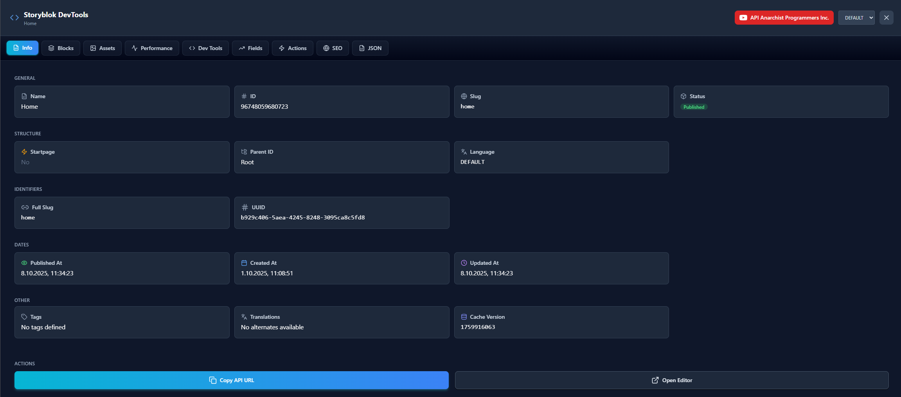
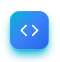
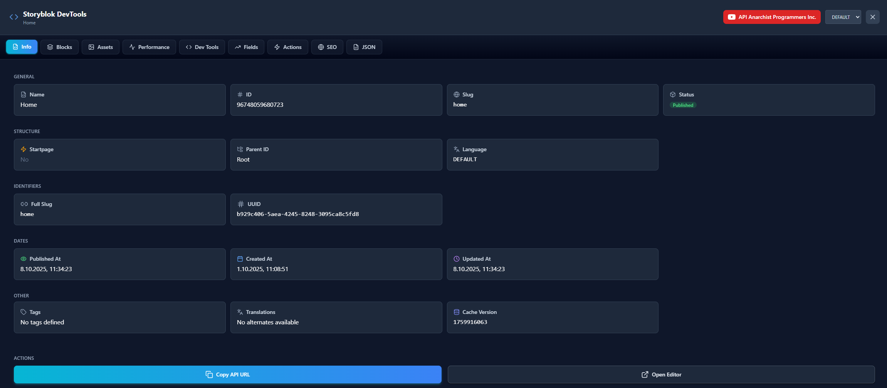
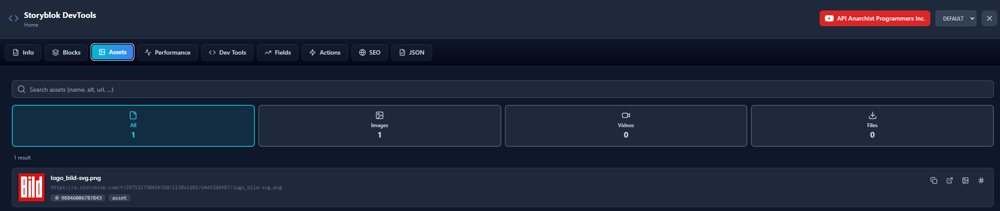
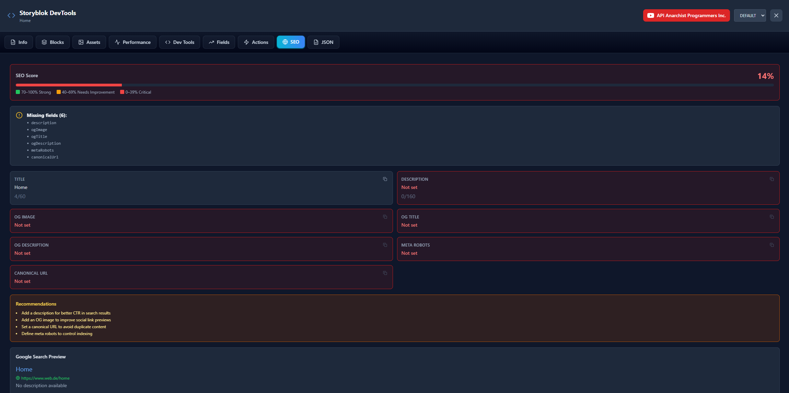
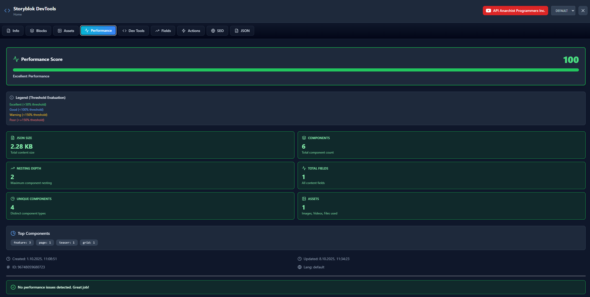
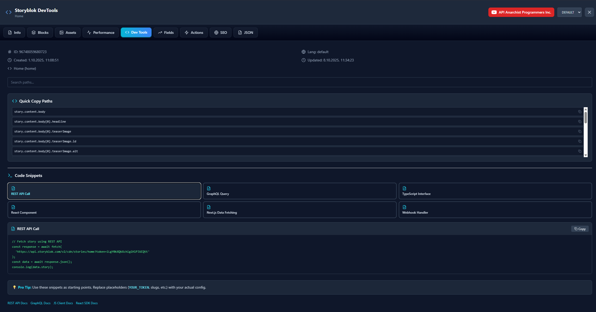

# Storyblok Dev Tools




[](https://www.npmjs.com/package/storyblok-dev-tools)
[](https://www.npmjs.com/package/storyblok-dev-tools)
[](https://opensource.org/licenses/MIT)
[](https://www.typescriptlang.org/)

Advanced developer tools overlay for Storyblok CMS in Next.js applications. Inspect stories, blocks, assets, SEO, performance metrics, and more - all directly in your Next.js application during development.




---

## Why Use Storyblok Dev Tools?

- **Instant Insights**: View complete story metadata, content structure, and field values without switching to the Storyblok dashboard
- **Zero Configuration**: Works out of the box - just pass your story object and access token
- **Framework Agnostic**: Uses Shadow DOM for style isolation - works with any CSS framework or none at all
- **Developer Friendly**: Keyboard shortcuts, quick copy actions, and raw JSON viewer for debugging
- **Performance Analysis**: Get instant feedback on content size, asset optimization, and component complexity
- **SEO at a Glance**: Real-time SEO score and Google search preview
- **Production Safe**: Easily disable for production builds with a simple conditional

---

## Features

### Story Information

- View complete story metadata (ID, UUID, slug, status, language)
- Display publishing information and timestamps
- Show workflow details (groups, releases)
- Manage tags and translations
- Quick access to API URLs and Storyblok editor

### Content Blocks Explorer

- Hierarchical component tree visualization
- Search and filter components
- Expand/collapse all functionality
- Detailed field inspection with type information
- Support for nested components and arrays

### Assets Manager

- Automatic asset detection (images, videos, files)
- Image dimension and format display
- Quick copy asset URLs
- Asset count statistics

### SEO Analysis

- SEO score calculation
- Missing field detection
- Google search preview
- Meta tags inspection
- Social media optimization checks

### Performance Metrics

- Content size analysis
- Component count statistics
- Asset optimization recommendations
- Loading performance insights

### Developer Tools

- Raw JSON viewer with pretty print
- Quick copy actions for IDs, slugs, URLs
- Field usage statistics
- API endpoint generator

---

## Installation

Install the package via npm:

```bash
npm install storyblok-dev-tools
```

Or with yarn:

```bash
yarn add storyblok-dev-tools
```

Or with pnpm:

```bash
pnpm add storyblok-dev-tools
```

---

## Quick Start

### Basic Usage

**Option 1: Pass the access token directly (recommended)**

```tsx
import { StoryblokDevTools } from 'storyblok-dev-tools';

export default function Page({ story }) {
  return (
    <>
      <StoryblokDevTools
        story={story}
        accessToken="your-storyblok-token"
      />
      {/* Your page content */}
    </>
  );
}
```

**Option 2: Use environment variable**

The component automatically reads `NEXT_PUBLIC_STORYBLOK_ACCESS_TOKEN`:

```tsx
import { StoryblokDevTools } from 'storyblok-dev-tools';

export default function Page({ story }) {
  return (
    <>
      <StoryblokDevTools story={story} />
      {/* Your page content */}
    </>
  );
}
```

The dev tools overlay will appear as a floating button at the top center. Click it to toggle the developer panel.

**No CSS framework required!** The package includes its own styles and works with any CSS setup (Bootstrap, Tailwind, Material UI, or no framework at all).

---

## Usage Examples

### Simple Integration

```tsx
import { StoryblokDevTools } from 'storyblok-dev-tools';

export default function MyPage({ story }) {
  return (
    <main>
      <StoryblokDevTools story={story} />
      <h1>{story.content.title}</h1>
      {/* Your content */}
    </main>
  );
}
```

### Conditional Rendering (Development Only)

```tsx
import { StoryblokDevTools } from 'storyblok-dev-tools';

export default function MyPage({ story }) {
  return (
    <main>
      {process.env.NODE_ENV === 'development' && (
        <StoryblokDevTools story={story} />
      )}
      {/* Your content */}
    </main>
  );
}
```

### Next.js App Router Example

```tsx
// app/[slug]/page.tsx
"use client";

import { storyblokInit, apiPlugin, getStoryblokApi } from "@storyblok/react";
import { StoryblokDevTools } from 'storyblok-dev-tools';
import { useEffect, useState } from 'react';

storyblokInit({
  accessToken: process.env.NEXT_PUBLIC_STORYBLOK_ACCESS_TOKEN,
  use: [apiPlugin],
});

export default function Page({ params }) {
  const [story, setStory] = useState(null);

  useEffect(() => {
    const fetchStory = async () => {
      const storyblokApi = getStoryblokApi();
      const { data } = await storyblokApi.get(`cdn/stories/${params.slug}`);
      setStory(data.story);
    };
    fetchStory();
  }, [params.slug]);

  if (!story) return <div>Loading...</div>;

  return (
    <>
      {process.env.NODE_ENV === 'development' && (
        <StoryblokDevTools story={story} />
      )}
      <main>{/* Your content */}</main>
    </>
  );
}
```

---

## API Reference

### StoryblokDevTools Component

Main component that provides the full developer tools overlay.

**Props:**

| Prop | Type | Required | Default | Description |
|------|------|----------|---------|-------------|
| `story` | `StoryblokStory` | Yes | - | The Storyblok story object to inspect |
| `accessToken` | `string` | No | env var | Storyblok API access token (reads from `NEXT_PUBLIC_STORYBLOK_ACCESS_TOKEN` if not provided) |

**Example:**
```tsx
<StoryblokDevTools
  story={storyData}
  accessToken="your-token-here"
/>
```

### Available Tabs

The dev tools panel includes the following tabs:

1. **Story Info** - Metadata, publishing info, tags, and translations
2. **Blocks** - Component tree with search and filtering
3. **Assets** - All images, videos, and files used in the story
4. **SEO** - SEO analysis and Google preview
5. **Performance** - Content size and optimization tips
6. **Dev Tools** - Quick actions and API endpoints
7. **Field Usage** - Statistics on field usage across components
8. **Quick Actions** - Copy IDs, slugs, and URLs
9. **JSON** - Raw JSON viewer with pretty print

---

## Requirements

- **React:** >=18.2.0 <20
- **Next.js:** ^13.5.0 || ^14.0.0 || ^15.0.0
- **Storyblok React SDK:** ^5.4.13

---

## Tech Stack

- **Framework:** Next.js
- **UI Library:** React 18
- **Styling:** Vanilla CSS with Shadow DOM (no framework required!)
- **Icons:** Lucide React
- **CMS Integration:** Storyblok React SDK

---

## Browser Support

- Chrome (latest)
- Firefox (latest)
- Safari (latest)
- Edge (latest)

---

## Troubleshooting

### Component doesn't appear

Make sure you're passing a valid Storyblok story object:

```tsx
// Story object should have this structure
const story = {
  id: 12345,
  uuid: "abc-123",
  name: "Home",
  slug: "home",
  content: { /* ... */ },
  // ... other story properties
};
```

### TypeScript errors

The package includes TypeScript definitions out of the box. If you encounter type errors, make sure your `tsconfig.json` includes:

```json
{
  "compilerOptions": {
    "moduleResolution": "node",
    "esModuleInterop": true
  }
}
```

### Access token not working

1. Verify your token is correct in the Storyblok dashboard
2. Make sure you're using a **Preview** token, not a **Public** token
3. Check that the token has access to the space you're querying

---

## Contributing

Contributions are welcome! Please feel free to submit a Pull Request.

1. Fork the repository
2. Create your feature branch (`git checkout -b feature/amazing-feature`)
3. Commit your changes (`git commit -m 'Add some amazing feature'`)
4. Push to the branch (`git push origin feature/amazing-feature`)
5. Open a Pull Request

For more details, see [DEVELOPMENT.md](./DEVELOPMENT.md)

---

## License

This project is licensed under the MIT License - see the [LICENSE](LICENSE) file for details.

---

## Acknowledgments

- Built with [Next.js](https://nextjs.org/)
- Powered by [Storyblok](https://www.storyblok.com/)
- Icons by [Lucide](https://lucide.dev/)
- Styling with [Tailwind CSS](https://tailwindcss.com/)

---

## Support

- **Issues:** [GitHub Issues](https://github.com/QuickLinkNet/StoryblokDevTools/issues)
- **Discussions:** [GitHub Discussions](https://github.com/QuickLinkNet/StoryblokDevTools/discussions)
- **Email:** support@quicklink.net

---

## Roadmap

- [ ] Support for other frameworks (Vue, Svelte)
- [ ] Custom theme support
- [ ] Plugin system for extending functionality
- [ ] Enhanced performance profiling
- [ ] Integration with Storyblok webhooks

---

## Keywords

storyblok, cms, nextjs, developer-tools, devtools, debug, overlay, inspector, storyblok-dev-tools, react, typescript

---

**Made with ❤️ by [QuickLink](https://github.com/QuickLinkNet)**


